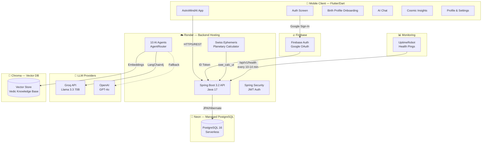
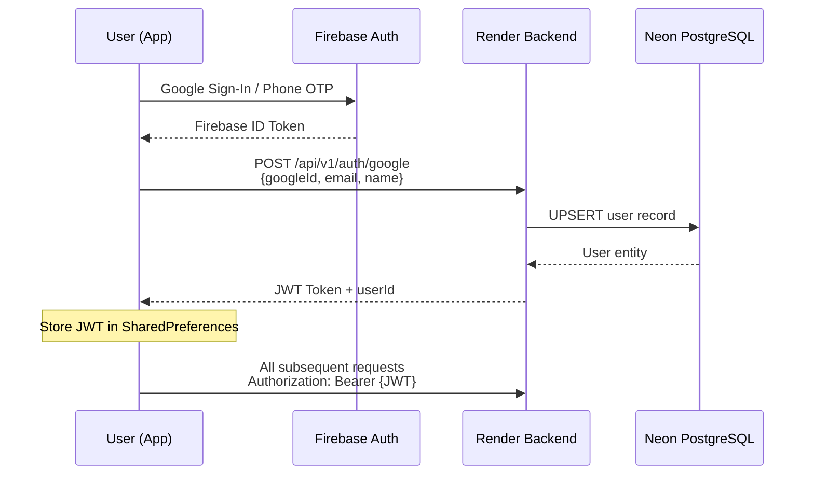
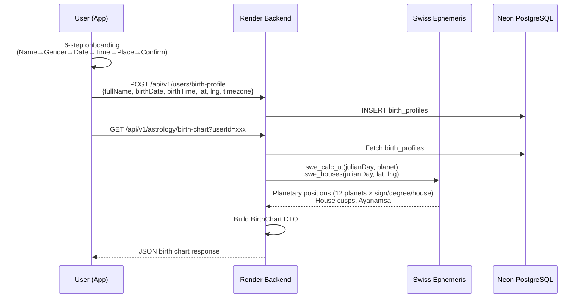
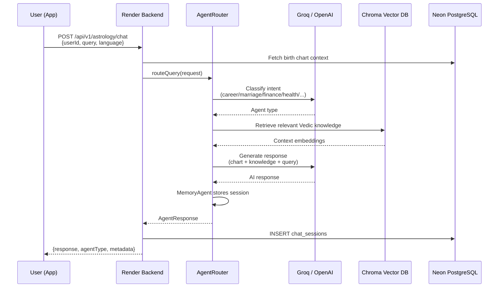
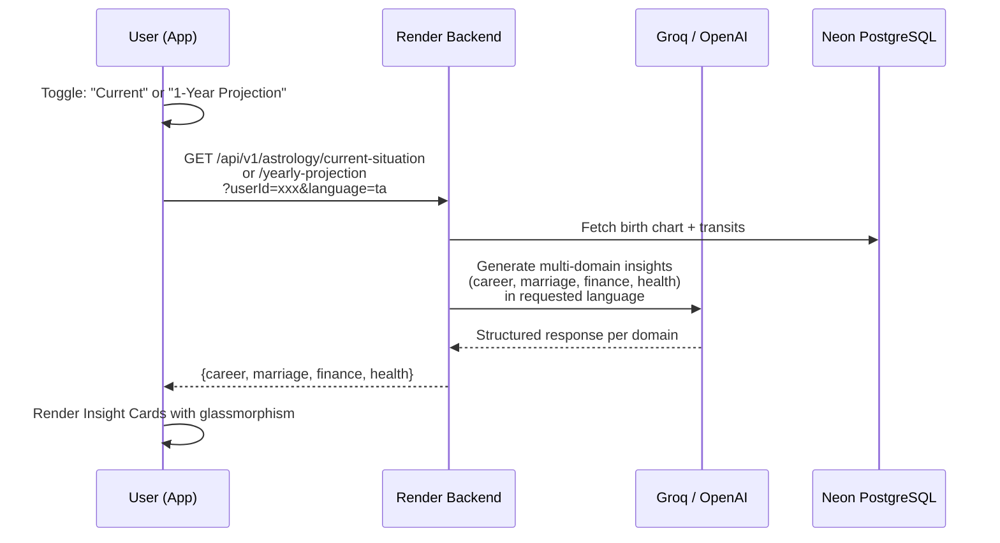
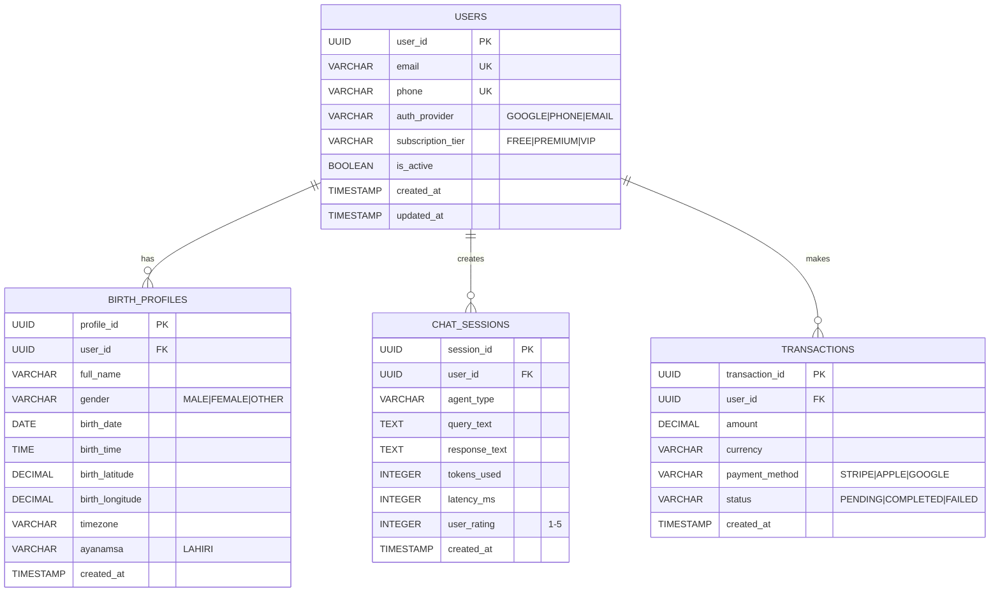
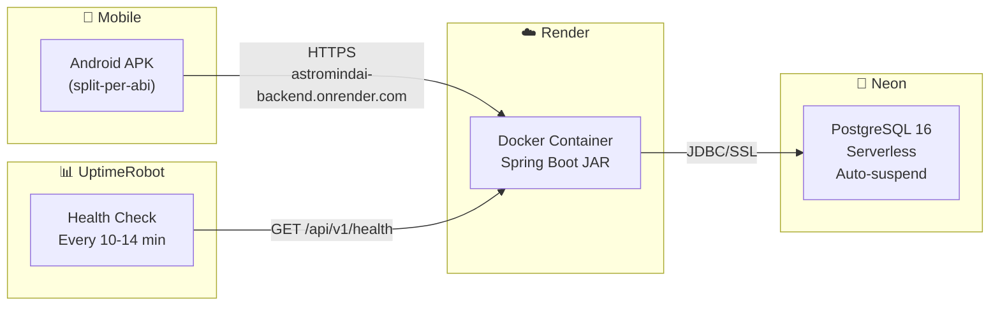
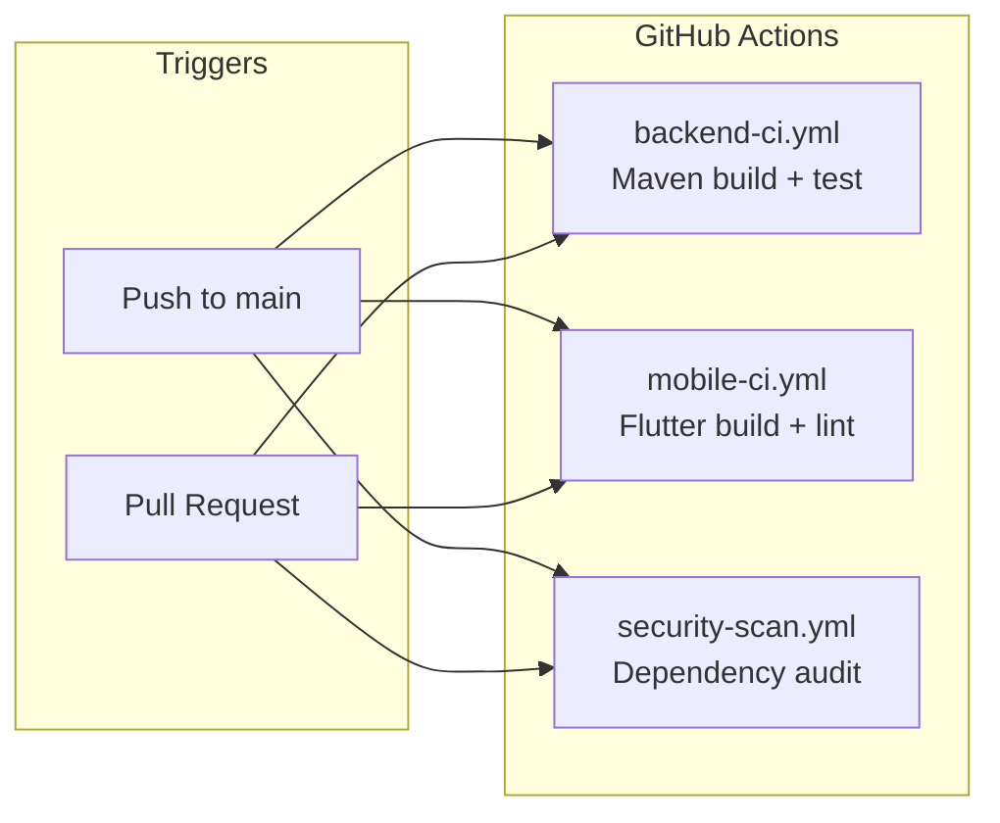
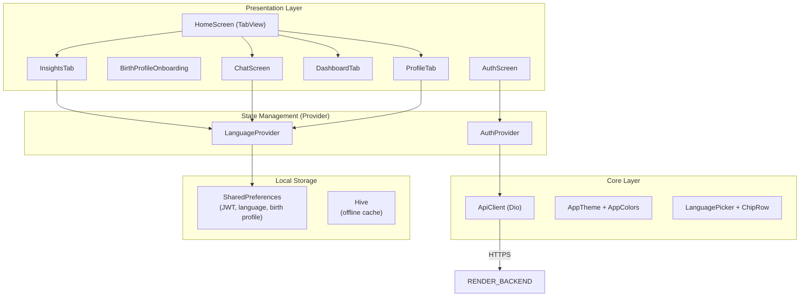

# AstroMindAI — Technical Architecture & Workflow Document

> **Project**: AstroMindAI (ASTRA) — AI Life Intelligence Platform  
> **Version**: 1.0.0 (MVP)  
> **Last Updated**: June 26, 2026

---

## 1. System Architecture Overview



---

## 2. Technology Stack

### 2.1 Mobile Client

| Layer | Technology | Version | Purpose |
|-------|-----------|---------|---------|
| **Framework** | Flutter | 3.x (Dart SDK ^3.11.5) | Cross-platform mobile UI |
| **State Management** | Provider | ^6.1.1 | Reactive state via `ChangeNotifier` |
| **Networking** | Dio | ^5.4.0 | HTTP client with interceptors, timeouts |
| **Auth** | Firebase Auth | ^6.5.3 | Google OAuth, Phone OTP |
| **Auth** | Google Sign-In | ^6.2.1 | Native Google login flow |
| **Location** | Geolocator | ^10.1.0 | GPS coordinates + settings deep-link |
| **Storage** | SharedPreferences | ^2.2.2 | Lightweight key-value persistence |
| **Storage** | Hive | ^2.2.3 | Local NoSQL for offline caching |
| **UI** | Google Fonts | ^6.1.0 | Playfair Display, Inter typography |
| **Charts** | Syncfusion Flutter Charts | ^24.1.41 | Birth chart / Dasha visualizations |
| **Formatting** | intl | ^0.18.1 | Date/time/number formatting |

### 2.2 Backend API

| Layer | Technology | Version | Purpose |
|-------|-----------|---------|---------|
| **Framework** | Spring Boot | 3.2.0 | REST API, dependency injection |
| **Language** | Java | 17 (LTS) | Backend runtime |
| **ORM** | Spring Data JPA + Hibernate | 3.2.x | Database access layer |
| **Security** | Spring Security | 3.2.x | Auth filters, CORS, endpoint protection |
| **JWT** | jjwt (io.jsonwebtoken) | 0.12.3 | Token generation, validation |
| **OAuth** | Spring OAuth2 Client | 3.2.x | Google OAuth integration |
| **AI/LLM** | LangChain4j | 0.29.1 | LLM orchestration framework |
| **AI/LLM** | LangChain4j OpenAI | 0.29.1 | OpenAI + Groq (OpenAI-compatible) |
| **AI/LLM** | LangChain4j Anthropic | 0.29.1 | Claude model support |
| **AI/LLM** | LangChain4j Vertex AI | 0.29.1 | Google Gemini support |
| **Embeddings** | All-MiniLM-L6-V2 | 0.29.1 | Local sentence embeddings for RAG |
| **Astrology** | Swiss Ephemeris | 2.01.00 | Planetary position calculations |
| **Connection Pool** | HikariCP | 5.x | High-performance JDBC pool |
| **Build** | Maven | 3.x | Dependency management, packaging |
| **Utilities** | Lombok | 1.18.x | Boilerplate reduction (@Builder, @Data) |

### 2.3 Infrastructure & Hosting

| Service | Provider | Plan | Purpose |
|---------|----------|------|---------|
| **Backend Hosting** | Render | Free Web Service | Spring Boot API deployment (Docker) |
| **Database** | Neon | Free Serverless PostgreSQL | Managed PostgreSQL 16 with auto-scaling |
| **Monitoring** | UptimeRobot | Free | Health check pings every 10-14 min |
| **Auth** | Firebase | Spark (Free) | Google OAuth, Phone OTP |
| **Vector DB** | Chroma | Self-hosted (Docker) | Vedic knowledge base embeddings |
| **Cache** | Redis 7 | Docker (local/staging) | Session & query caching |
| **CI/CD** | GitHub Actions | Free | Automated build, test, security scan |
| **Container** | Docker | — | Backend packaging & deployment |
| **Orchestration** | Kubernetes | — | Production manifests (prepared) |

---

## 3. Data Flow & Workflow

### 3.1 Authentication Flow



**Auth Methods Available:**
- **Google OAuth** → Firebase Auth → Backend JWT
- **Email/Password** → Backend register/login → JWT
- **Phone OTP** → Backend send-otp/verify-otp → JWT
- **Demo Mode** → `POST /api/v1/auth/demo` → Auto-created premium user + JWT

### 3.2 Birth Profile & Chart Calculation Flow



**Swiss Ephemeris Calculations:**
- 12 planetary bodies: Sun, Moon, Mars, Mercury, Jupiter, Venus, Saturn, Rahu, Ketu, Uranus, Neptune, Pluto
- Lahiri Ayanamsa (default) for sidereal positions
- House calculations using Placidus system
- Nakshatra determination (27 lunar mansions)

### 3.3 AI Chat Routing Flow



**10 AI Agents:**

| Agent | Route Key | Domain |
|-------|-----------|--------|
| ChartGenerator | `chart_generator` | Birth chart interpretation, Kundli reading |
| PlanetAnalysis | `planet_analysis` | Planetary strengths, retrogrades, combustion |
| DashaAnalysis | `dasha_analysis` | Mahadasha/Antardasha timing & predictions |
| TransitAnalysis | `transit_analysis` | Current Gochara, weekly/monthly transits |
| CareerGuidance | `career_guidance` | 10th house, profession, business advice |
| MarriageGuidance | `marriage_guidance` | 7th house, relationships, compatibility |
| FinanceGuidance | `finance_guidance` | 2nd/11th house, wealth, investments |
| HealthGuidance | `health_guidance` | 6th house, wellness, medical astrology |
| SpiritualGuidance | `spiritual_guidance` | 5th/9th house, mantras, remedies, meditation |
| MemoryAgent | `memory_agent` | Conversation history for context continuity |

**LLM Priority Chain:**
1. **Groq** (Llama 3.3 70B) — Primary, fastest inference
2. **OpenAI** (GPT-4o) — Fallback
3. **Template Responses** — When no API keys configured (chart-aware hardcoded)

### 3.4 Insights & Projection Flow



---

## 4. Database Schema (Neon PostgreSQL)



---

## 5. Vector Knowledge Base (Chroma)

The Vedic knowledge base is seeded at startup with **12 authoritative texts** and **10 planetary remedies**:

| Collection | Contents | Embedding Model |
|-----------|----------|----------------|
| **Vedic Texts** | Brihat Parashara Hora, Jaimini Sutras, Saravali, Phaladeepika, Brihat Jataka, Uttara Kalamrita, Chamatkar Chintamani, KP System, Nadi Astrology, Bhrigu Samhita, Lal Kitab, Prasna Marga | All-MiniLM-L6-V2 |
| **Remedies** | Gemstone therapy, Mantra prescriptions, Yantra meditation, Charity recommendations, Fasting protocols, Color therapy, Directional remedies, Deity worship, Herbal remedies, Lifestyle modifications | All-MiniLM-L6-V2 |

---

## 6. API Endpoints

| Endpoint | Method | Auth | Description |
|----------|--------|------|-------------|
| `/api/v1/health` | GET | No | Health check (pinged by UptimeRobot) |
| `/api/v1/auth/google` | POST | No | Google OAuth login → JWT |
| `/api/v1/auth/register` | POST | No | Email/password registration → JWT |
| `/api/v1/auth/login` | POST | No | Email/password login → JWT |
| `/api/v1/auth/phone/send-otp` | POST | No | Send phone OTP |
| `/api/v1/auth/phone/verify-otp` | POST | No | Verify OTP → JWT |
| `/api/v1/auth/demo` | POST | No | Demo login → premium user + JWT |
| `/api/v1/users/profile` | GET/POST | JWT | User CRUD |
| `/api/v1/users/birth-profile` | GET/POST/PUT | JWT | Birth profile CRUD |
| `/api/v1/astrology/birth-chart` | GET | JWT | Swiss Ephemeris chart calculation |
| `/api/v1/astrology/chat` | POST | JWT | AI chat with agent routing |
| `/api/v1/astrology/dasha-timeline` | GET | JWT | Vimshottari Dasha periods |
| `/api/v1/astrology/transits` | GET | JWT | Current planetary transits |
| `/api/v1/astrology/current-situation` | GET | JWT | Multi-domain current analysis |
| `/api/v1/astrology/yearly-projection` | GET | JWT | 12-month AI-driven projection |
| `/api/v1/astrology/daily-horoscope` | GET | JWT | Daily horoscope |
| `/api/v1/astrology/life-summary` | GET | JWT | Comprehensive life summary |
| `/api/v1/subscriptions/plans` | GET | JWT | Subscription tiers |

---

## 7. Deployment Architecture

### 7.1 Production (Current)



**Render Configuration** (`render.yaml`):
- **Type**: Web Service (Docker)
- **Plan**: Free tier
- **Health Check**: `/api/v1/health`
- **Profile**: `prod` (Spring Boot)
- **Env Vars**: `SPRING_DATASOURCE_URL`, `SPRING_DATASOURCE_USERNAME`, `SPRING_DATASOURCE_PASSWORD`, LLM API keys (all stored securely in Render dashboard)

**UptimeRobot**:
- Pings `/api/v1/health` every 10–14 minutes
- Prevents Render free-tier idle sleep (spins down after 15 min inactivity)
- Alerts on downtime

### 7.2 Local Development

```bash
# Backend (zero-dependency dev mode with H2)
cd backend
mvn spring-boot:run -Dspring-boot.run.profiles=dev

# Backend (full stack with Docker)
cd infrastructure
docker-compose up -d  # PostgreSQL 15, Chroma, Redis 7, Backend

# Mobile
cd mobile/astra_app
flutter run
```

### 7.3 Production-Ready (Kubernetes — Prepared)

K8s manifests available in `/infrastructure/k8s/`:

| Manifest | Purpose |
|----------|---------|
| `backend-deployment.yaml` | Backend pods + service |
| `postgres-deployment.yaml` | PostgreSQL StatefulSet |
| `chroma-deployment.yaml` | Chroma vector DB |
| `redis-deployment.yaml` | Redis cache |
| `ingress.yaml` | NGINX ingress routing |
| `secrets.yaml` | K8s secrets (needs real base64 values) |
| `configmap.yaml` | App configuration |
| `horizontal-pod-autoscaler.yaml` | Auto-scaling rules |
| `prometheus-deployment.yaml` | Metrics collection |
| `prometheus-configmap.yaml` | Prometheus scrape config |
| `grafana-deployment.yaml` | Metrics dashboard |

---

## 8. CI/CD Pipeline



| Workflow | File | Actions |
|----------|------|---------|
| **Backend CI** | `backend-ci.yml` | Maven compile, test, package |
| **Mobile CI** | `mobile-ci.yml` | Flutter analyze, build APK |
| **Security Scan** | `security-scan.yml` | Dependency vulnerability audit |

---

## 9. Mobile App Architecture



**Supported Languages** (14 Indian languages + English):
English, Hindi, Tamil, Telugu, Marathi, Bengali, Gujarati, Kannada, Malayalam, Punjabi, Odia, Assamese, Urdu, Sanskrit

---

## 10. Security Architecture

| Layer | Implementation |
|-------|---------------|
| **Authentication** | Firebase Auth (Google OAuth, Phone OTP) + Backend JWT |
| **Authorization** | Spring Security filter chain, JWT validation on every request |
| **Token** | JJWT (io.jsonwebtoken) — HS256, expiration enforced |
| **Password** | BCrypt via `PasswordEncoderConfig` |
| **CORS** | Whitelisted origins via `CorsConfig` |
| **API Keys** | Stored in Render environment variables (never in code) |
| **Mobile Storage** | JWT stored in SharedPreferences (platform-encrypted on Android) |
| **Transport** | HTTPS enforced (Render provides TLS) |
| **DB Connection** | SSL-mode via Neon (encrypted in transit) |

---

## 11. Build & Release

### Android APK (Split-per-ABI)

```bash
flutter build apk --split-per-abi --release --obfuscate --split-debug-info=build/debug-info
```

| ABI | Target Devices |
|-----|---------------|
| `armeabi-v7a` | Older 32-bit Android phones |
| `arm64-v8a` | Modern 64-bit Android (majority) |
| `x86_64` | Emulators, Chromebooks |

---

## 12. Monitoring & Observability

| Tool | Purpose | Configuration |
|------|---------|--------------|
| **UptimeRobot** | Backend uptime monitoring | Pings `GET /api/v1/health` every 10-14 min; alerts on downtime |
| **Render Logs** | Application logging | Real-time log streaming in Render dashboard |
| **Neon Dashboard** | Database metrics | Query performance, storage, connection count |
| **Prometheus** (K8s) | Metrics collection | Prepared manifests for production K8s |
| **Grafana** (K8s) | Metrics visualization | Prepared manifests for production K8s |

---

## 13. Project Structure

```
AstroMindAI/
├── backend/                        # Spring Boot API
│   ├── src/main/java/com/astra/
│   │   ├── AstraApplication.java   # Entry point
│   │   ├── ai/                     # 10 AI agents + AgentRouter
│   │   │   └── vector/             # ChromaService, KnowledgeBaseService
│   │   ├── astrology/              # SwissEphemeris, DashaCalculator, TransitCalculator
│   │   ├── config/                 # AiConfig, SecurityConfig, CorsConfig, JpaConfig
│   │   ├── controller/             # REST controllers (6 controllers)
│   │   ├── model/                  # JPA entities (User, BirthProfile, ChatSession, Transaction)
│   │   ├── repository/             # Spring Data JPA repositories
│   │   ├── security/               # JWT filter, token provider, auth service
│   │   └── service/                # BirthProfileService, UserService
│   ├── pom.xml                     # Maven dependencies
│   └── Dockerfile                  # Container build
│
├── mobile/astra_app/               # Flutter mobile app
│   ├── lib/
│   │   ├── main.dart               # App entry, MultiProvider, routing
│   │   ├── core/
│   │   │   ├── providers/          # AuthProvider, LanguageProvider
│   │   │   ├── network/            # ApiClient (Dio)
│   │   │   └── theme/              # AppTheme, AppColors, LanguagePicker
│   │   ├── features/
│   │   │   ├── auth/               # AuthScreen (Google, Phone, Email, Demo)
│   │   │   ├── birth_profile/      # 6-step onboarding wizard
│   │   │   ├── chat/               # AI chat with agent routing
│   │   │   ├── home/               # Dashboard, Insights, Profile tabs
│   │   │   └── astrology/          # Birth chart visualization
│   │   └── shared/                 # Shared widgets
│   └── pubspec.yaml                # Flutter dependencies
│
├── infrastructure/
│   ├── docker-compose.yml          # Local: PostgreSQL, Chroma, Redis, Backend
│   └── k8s/                        # 11 Kubernetes manifests
│
├── .github/workflows/              # CI/CD: backend-ci, mobile-ci, security-scan
├── docs/                           # PRD, Accuracy documentation
├── render.yaml                     # Render deployment blueprint
├── neon_init.sql                   # Database schema initialization
└── working.md                      # Project status tracker
```
